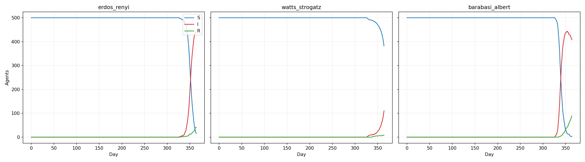

# SIR-Epidemie auf Netzwerken

## Abstract

In diesem Projekt wird untersucht, wie sich eine Infektionskrankheit in unterschiedlichen Kontaktnetzwerken ausbreitet. Grundlage ist ein SIR-Modell, bei dem Personen als Knoten und Kontakte als Kanten dargestellt werden. Jede Person kann entweder suszeptibel (`S`), infiziert (`I`) oder genesen (`R`) sein. Die zentrale Forschungsfrage lautet, wie stark die Netzwerkstruktur den Verlauf einer Epidemie beeinflusst, wenn die epidemiologischen Parameter gleich bleiben. Dafür wurden drei Netzwerktypen verglichen: ein Erdős-Rényi-Zufallsnetzwerk, ein Watts-Strogatz-Small-World-Netzwerk und ein Barabási-Albert-Netzwerk. Zusätzlich enthält das Modell gewichtete Kontakte, saisonale Effekte und eine interaktive Visualisierung. Die Ergebnisse zeigen deutliche Unterschiede zwischen den Netzwerken: Während sich die Infektion im Barabási-Albert-Netzwerk fast auf die gesamte Population ausbreitet, bleibt sie im Watts-Strogatz-Netzwerk stärker begrenzt. Eine wichtige Einschränkung ist, dass das Modell stark vereinfacht ist und keine realen Kontaktdaten, keine Verhaltensanpassungen und keine Maßnahmen wie Quarantäne oder Impfung berücksichtigt.

## 1. Introduction

Die Ausbreitung von Infektionskrankheiten ist ein typisches Beispiel für ein dynamisches System. Einzelne Übertragungen finden lokal zwischen Personen statt, aber aus vielen solchen lokalen Kontakten kann ein Verlauf entstehen, der die gesamte Population betrifft. Gerade deshalb eignen sich Epidemien gut für systemwissenschaftliche Modellierung: Es geht nicht nur um einzelne Personen, sondern um die Struktur der Beziehungen zwischen ihnen.

Ein bekannter Ausgangspunkt für die Modellierung von Epidemien ist das SIR-Modell. Dabei wird die Bevölkerung in drei Gruppen eingeteilt. Suszeptible Personen (`S`) sind gesund, können aber infiziert werden. Infizierte Personen (`I`) können die Krankheit weitergeben. Genesene Personen (`R`) sind im Modell nicht mehr infektiös und werden nicht erneut infiziert. Das Modell ist einfach, aber trotzdem hilfreich, um grundlegende Dynamiken einer Epidemie sichtbar zu machen.

In vielen klassischen SIR-Modellen wird angenommen, dass die Bevölkerung gut durchmischt ist. Das bedeutet vereinfacht, dass jede Person mit jeder anderen Person in Kontakt kommen kann. Diese Annahme macht das Modell übersichtlich, ist aber für reale Kontakte oft zu stark vereinfacht. Menschen haben nicht zufällig mit allen anderen Personen Kontakt. Kontakte entstehen zum Beispiel über Familie, Freundeskreise, Arbeit, Studium, Freizeit oder räumliche Nähe. Manche Personen haben sehr viele Kontakte, andere nur wenige. Manche Kontakte liegen in engen Gruppen, andere verbinden weit entfernte Teile eines sozialen Netzwerks.

Deshalb wurde in diesem Projekt ein SIR-Modell auf Netzwerken umgesetzt. Personen werden als Knoten dargestellt, Kontakte zwischen Personen als Kanten. Eine Infektion kann sich dadurch nur entlang vorhandener Kanten ausbreiten. Damit wird die Netzwerkstruktur selbst zu einem wichtigen Teil des Modells. Zwei Netzwerke können dieselbe Anzahl an Personen und dieselben epidemiologischen Parameter haben, aber trotzdem unterschiedliche Epidemieverläufe zeigen, wenn die Kontakte anders angeordnet sind.

Im Projekt werden drei Netzwerktypen verglichen. Das Erdős-Rényi-Netzwerk bildet zufällige Kontakte ab. Jede mögliche Kante zwischen zwei Knoten entsteht mit einer bestimmten Wahrscheinlichkeit. Dadurch ist das Netzwerk relativ homogen. Das Watts-Strogatz-Netzwerk beschreibt eine Small-World-Struktur. Es besitzt lokale Cluster, aber auch einzelne Verbindungen, die weiter entfernte Teile des Netzwerks verbinden. Das Barabási-Albert-Netzwerk erzeugt eine skalenfreie Struktur. Dabei entstehen wenige Knoten mit sehr vielen Verbindungen, sogenannte Hubs. Solche Hubs können für Epidemien besonders wichtig sein, weil sie viele andere Knoten erreichen.

Die Forschungsfrage lautet daher:

**Wie beeinflusst die Netzwerkstruktur den Verlauf einer SIR-Epidemie bei gleichen epidemiologischen Parametern?**

Untersucht wird besonders, wie viele Personen am Ende noch suszeptibel sind, wie viele infiziert bleiben und wie stark sich die Krankheit in den drei Netzwerktypen ausbreitet. Das Ziel ist nicht, eine konkrete reale Krankheit vorherzusagen. Vielmehr soll gezeigt werden, wie stark die Struktur von Kontakten den Verlauf einer Epidemie verändern kann.

## 2. Method

### 2.1 Grundidee des Modells

Das Modell ist ein agentenbasiertes SIR-Modell auf einem Netzwerk. Die einzelnen Personen sind die Agenten. Sie werden als Knoten in einem Netzwerk dargestellt. Kontakte zwischen Personen werden als Kanten modelliert. Eine Person kann nur dann eine andere Person anstecken, wenn zwischen beiden eine Kante existiert.

Jeder Knoten besitzt einen Zustand:

- `S`: suszeptibel, also gesund, aber infizierbar
- `I`: infiziert und infektiös
- `R`: genesen bzw. recovered

Die Simulation läuft in diskreten Zeitschritten. Ein Zeitschritt wird als ein Tag interpretiert. In jedem Schritt können infizierte Knoten ihre suszeptiblen Nachbarn anstecken. Außerdem können infizierte Knoten genesen und in den Zustand `R` wechseln. Nach jedem Schritt werden die Anzahlen der Zustände `S`, `I` und `R` gespeichert.

Die Population ist geschlossen. Es gibt keine Geburten, Todesfälle, Migration oder Infektionen von außen. Diese Vereinfachung wurde gewählt, damit der Einfluss der Netzwerkstruktur klarer sichtbar bleibt.

### 2.2 Parameter und Auswertung

Die wichtigsten Parameter des Modells sind:

- `N`: Anzahl der Personen bzw. Knoten
- `beta`: Basiswahrscheinlichkeit für eine Infektion
- `gamma`: Basiswahrscheinlichkeit für Genesung
- `time_steps`: Anzahl der simulierten Tage
- `target_avg_degree`: gewünschter durchschnittlicher Knotengrad
- `seed`: Zufallswert zur Reproduzierbarkeit
- `weighted_mode`: legt fest, ob Kanten gewichtet werden
- `topology_type`: Netzwerktyp

Im getesteten Standardlauf wurden folgende Einstellungen verwendet:

| Parameter | Wert |
|---|---:|
| `N` | 500 |
| `beta` | 0.05 |
| `gamma` | 0.01 |
| `time_steps` | 365 |
| `target_avg_degree` | 8 |
| `seed` | 42 |
| `weighted_mode` | False |

Ausgewertet werden die Zeitreihen von `S(t)`, `I(t)` und `R(t)`. Zusätzlich werden im Code Kennzahlen wie `peak_infected`, `peak_day`, `final_recovered` und `duration_days` berechnet. Für den Bericht wurden besonders die finalen Zustände am letzten Simulationstag verglichen.

### 2.3 Netzwerktypen

Die Netzwerke werden mit `networkx` erzeugt. Im Code werden drei Topologien unterstützt:

- `erdos_renyi`
- `watts_strogatz`
- `barabasi_albert`

Das Erdős-Rényi-Netzwerk wird als Zufallsnetzwerk erzeugt. Die Kontaktwahrscheinlichkeit wird dabei so berechnet, dass ungefähr der gewünschte durchschnittliche Grad erreicht wird. Dieses Netzwerk dient als einfache Zufallsstruktur.

Das Watts-Strogatz-Netzwerk wird als Small-World-Netzwerk erzeugt. Die Knoten werden zunächst lokal verbunden, danach werden einzelne Kanten mit einer Wahrscheinlichkeit umverdrahtet. Dadurch entstehen lokale Cluster und gleichzeitig Abkürzungen im Netzwerk.

Das Barabási-Albert-Netzwerk wird durch bevorzugtes Anbinden erzeugt. Neue Knoten verbinden sich eher mit Knoten, die bereits viele Verbindungen besitzen. Dadurch entstehen Hubs. Diese können die Ausbreitung einer Epidemie beschleunigen, weil sie viele Kontakte bündeln.

Ein Ausschnitt aus dem Code zeigt die Auswahl der Topologie:

```python
if topology_type == "erdos_renyi":
    graph = create_erdos_renyi_network(
        n=n,
        target_avg_degree=target_avg_degree,
        seed=seed
    )
elif topology_type == "watts_strogatz":
    graph = create_watts_strogatz_network(
        n=n,
        target_avg_degree=target_avg_degree,
        seed=seed
    )
else:
    graph = create_barabasi_albert_network(
        n=n,
        target_avg_degree=target_avg_degree,
        seed=seed
    )
```

Der Code zeigt, dass alle drei Netzwerke über dieselbe Funktion `create_network` erzeugt werden können. Dadurch kann die Netzwerkstruktur gewechselt werden, ohne die eigentliche SIR-Simulation zu verändern. Das ist wichtig, weil die Forschungsfrage genau den Vergleich der Netzwerktypen betrifft.

### 2.4 Gewichtete Kontakte

Zusätzlich zu ungewichteten Kontakten kann das Modell auch gewichtete Kanten verwenden. Dabei bekommt jede Kante ein Gewicht. Dieses Gewicht kann als vereinfachte Kontaktintensität interpretiert werden. Ein stärkerer Kontakt erhöht die Wahrscheinlichkeit einer Infektion stärker als ein schwacher Kontakt.

Im Code wird das Gewicht der Kanten entweder auf `1.0` gesetzt oder zufällig über eine Anzahl von Begegnungstagen erzeugt:

```python
def assign_edge_weights(graph, weighted_mode, rng):
    for source, target in graph.edges:
        if weighted_mode:
            encounter_days = rng.randint(1, 365)
            weight = encounter_days / 365.0
        else:
            weight = 1.0
        graph[source][target]["weight"] = weight
```

Diese Erweiterung ist eine einfache Möglichkeit, unterschiedlich intensive Kontakte abzubilden. In einer realen Population sind Kontakte nicht alle gleich. Manche Personen treffen sich täglich, andere nur selten. Das Modell bildet diese Unterschiede nicht realistisch im Detail ab, aber es führt zumindest eine einfache Heterogenität der Kontakte ein.

### 2.5 Ablauf eines Simulationsschritts

Die Simulation verwendet eine synchrone Aktualisierung. Das bedeutet, dass neue Zustände zuerst berechnet und erst danach gemeinsam übernommen werden. Dadurch kann eine Person, die in einem Zeitschritt neu infiziert wird, nicht sofort im selben Zeitschritt weitere Personen anstecken.

Zuerst wird für jeden Knoten der aktuelle Zustand als `next_state` übernommen. Danach wird für infizierte Knoten geprüft, ob sie suszeptible Nachbarn infizieren. Außerdem wird geprüft, ob infizierte Knoten genesen. Am Ende werden die berechneten `next_state`-Werte übernommen.

Der zentrale Teil der Infektionsregel sieht so aus:

```python
for neighbor in self.graph.neighbors(node):
    if self.graph.nodes[neighbor]["state"] != SUSCEPTIBLE:
        continue

    weight = float(self.graph[node][neighbor].get("weight", 1.0))
    p_inf = max(0.0, min(self.beta * weight, 1.0))

    if self.rng.random() <= p_inf:
        self.graph.nodes[neighbor]["next_state"] = INFECTED
```

Dieser Code beschreibt die lokale Infektion entlang einer Kante. Nur suszeptible Nachbarn können infiziert werden. Die Infektionswahrscheinlichkeit hängt von `beta` und vom Gewicht der Kante ab. Damit steckt in der Regel die Annahme, dass intensivere Kontakte ein höheres Infektionsrisiko haben.

Die Genesung erfolgt mit einer Genesungswahrscheinlichkeit `gamma_t`. Diese kann je nach Tag saisonal angepasst werden. Wenn ein zufälliger Wert kleiner oder gleich `gamma_t` ist, wechselt ein infizierter Knoten in den Zustand `R`.

### 2.6 Saisonale Komponente

Das Modell enthält zusätzlich eine einfache saisonale Komponente. Im Winter wird die Genesungsrate reduziert. Dadurch bleiben Infizierte im Durchschnitt länger infektiös. Diese Annahme ist bewusst einfach gehalten und soll nicht eine konkrete Krankheit exakt abbilden. Sie dient eher dazu, zu zeigen, wie ein externer zeitabhängiger Faktor in das Modell eingebaut werden kann.

Im Code wird geprüft, ob ein Tag im Winter liegt. Danach wird `gamma` entsprechend angepasst:

```python
def get_seasonal_gamma(self, day):
    gamma = self.gamma_base * (0.8 if self._is_winter(day) else 1.0)
    return max(0.0, min(gamma, 1.0))
```

Diese Regel senkt die Genesungswahrscheinlichkeit im Winter auf 80 % des Basiswertes. Dadurch kann sich die Epidemie in Winterphasen länger halten. Die saisonale Komponente ist eine Modellvereinfachung, aber sie erweitert das reine SIR-Modell um einen zeitabhängigen Effekt.

### 2.7 Beobachtung und Visualisierung

Nach jedem Simulationsschritt werden die Knoten gezählt. Gespeichert wird, wie viele Knoten sich in den Zuständen `S`, `I` und `R` befinden. Diese Werte werden später als Kurven dargestellt. Zusätzlich kann das Netzwerk selbst angezeigt werden, wobei die Knoten nach Zustand eingefärbt werden.

Die Visualisierung wird mit `matplotlib` umgesetzt. Die Oberfläche erlaubt es, den Netzwerktyp auszuwählen, gewichtete Kanten ein- oder auszuschalten und Parameter wie `N`, `beta`, `gamma`, Simulationsdauer, durchschnittlichen Grad und Seed zu verändern. Dadurch kann man schnell ausprobieren, wie sich einzelne Einstellungen auf den Verlauf auswirken.

Für die Netzwerkerzeugung wird `networkx` verwendet. `random` wird für Zufallsentscheidungen genutzt, zum Beispiel bei Infektionen, Genesungen und Kontaktgewichten. `dataclasses` wird verwendet, um Simulationsergebnisse strukturiert zu speichern. `matplotlib` dient zur Darstellung der Netzwerke und der SIR-Kurven.

## 3. Results

Für den Vergleich wurden alle drei Netzwerktypen mit denselben Grundeinstellungen simuliert. Die wichtigsten Parameter waren `N = 500`, `beta = 0.05`, `gamma = 0.01`, `time_steps = 365`, `target_avg_degree = 8` und `seed = 42`. Die gewichteten Kanten waren für diesen Vergleich deaktiviert. Verglichen wurde der Zustand am letzten Simulationstag (`day = 364`).

Die folgende Tabelle zeigt die Endwerte der drei Läufe:

| Netzwerktyp | Suszeptibel `S` | Infiziert `I` | Genesen `R` |
|---|---:|---:|---:|
| Erdős-Rényi | 15 | 444 | 41 |
| Watts-Strogatz | 382 | 110 | 8 |
| Barabási-Albert | 3 | 408 | 89 |

Die Unterschiede zwischen den Netzwerktypen sind deutlich. Im Erdős-Rényi-Netzwerk bleiben am Ende nur 15 von 500 Personen suszeptibel. Die Infektion erreicht also fast die gesamte Population. Am letzten Tag sind 444 Personen infiziert und 41 Personen genesen. Der Ausbruch setzt relativ spät ein, wächst dann aber sehr schnell.

Im Watts-Strogatz-Netzwerk bleibt die Ausbreitung deutlich stärker begrenzt. Am Ende sind noch 382 Personen suszeptibel, 110 infiziert und 8 genesen. Das zeigt, dass die lokale Struktur des Netzwerks die Ausbreitung verlangsamt oder zumindest stärker begrenzt. Die Infektion bleibt eher in Teilbereichen des Netzwerks, statt sofort die gesamte Population zu erfassen.

Im Barabási-Albert-Netzwerk ist die Ausbreitung besonders stark. Nur 3 Personen bleiben suszeptibel, während 408 Personen infiziert und 89 Personen genesen sind. Das passt zur Struktur dieses Netzwerks. Durch Hubs kann die Infektion sehr schnell viele Knoten erreichen. Wenn ein stark vernetzter Knoten infiziert wird, kann sich die Epidemie über viele Verbindungen weiter ausbreiten.

Die Ergebnisse unterstützen die Forschungsfrage deutlich: Die Netzwerkstruktur beeinflusst den Verlauf der Epidemie stark. Obwohl dieselben epidemiologischen Parameter verwendet wurden, unterscheiden sich die Endzustände deutlich. Besonders auffällig ist der Unterschied zwischen Watts-Strogatz und Barabási-Albert. Im Watts-Strogatz-Netzwerk bleiben viele Personen gesund, während im Barabási-Albert-Netzwerk fast alle Personen erreicht werden.

Für den Bericht können die erzeugten Abbildungen aus dem Repository eingebunden werden. Eine zentrale Abbildung ist der Vergleich der drei Topologien:

```markdown

```

Die Abbildung zeigt die Kurven von `S`, `I` und `R` für die drei Netzwerktypen. Besonders gut erkennbar ist, dass die Epidemie nicht in allen Netzwerken gleich verläuft. Die Kurven steigen zwar in allen Fällen erst spät stark an, aber die Stärke des Ausbruchs und die Endwerte unterscheiden sich deutlich.

Zusätzlich zur Vergleichsgrafik ist die interaktive Visualisierung hilfreich. Sie zeigt links die Netzwerkstruktur und rechts die SIR-Kurven. Dadurch wird sichtbar, wie Netzwerkstruktur und Epidemieverlauf zusammenhängen. Vor allem beim Barabási-Albert-Netzwerk erkennt man die dichtere Verbindung über zentrale Knoten, während das Watts-Strogatz-Netzwerk stärker lokal organisiert wirkt.

## 4. Discussion, Conclusion and Limitations

Die Ergebnisse zeigen, dass die Struktur des Kontaktnetzwerks einen deutlichen Einfluss auf den Verlauf der Epidemie hat. Die verwendeten epidemiologischen Parameter waren gleich, trotzdem unterscheiden sich die Endzustände der Simulationen stark. Damit wird die Forschungsfrage klar beantwortet: Nicht nur `beta` und `gamma` bestimmen den Verlauf, sondern auch die Frage, wer mit wem verbunden ist.

Das Barabási-Albert-Netzwerk zeigt eine besonders starke Ausbreitung. Das lässt sich durch die Hubs erklären. Stark vernetzte Knoten verbinden viele andere Knoten miteinander. Wenn ein solcher Knoten infiziert wird oder indirekt erreicht wird, kann die Infektion sehr viele weitere Knoten erreichen. Dadurch bleibt am Ende fast niemand suszeptibel.

Das Watts-Strogatz-Netzwerk zeigt im Vergleich eine deutlich schwächere Ausbreitung. Hier bleiben viele Personen suszeptibel. Eine mögliche Erklärung ist die stärkere lokale Struktur. Lokale Cluster können zwar innerhalb eines Bereichs Ausbrüche ermöglichen, aber die Infektion erreicht nicht automatisch alle anderen Bereiche des Netzwerks. Einzelne Long-Range-Verbindungen können zwar weitere Bereiche verbinden, aber die Ausbreitung bleibt in diesem Lauf trotzdem begrenzter.

Das Erdős-Rényi-Netzwerk liegt in den Ergebnissen näher am Barabási-Albert-Netzwerk als am Watts-Strogatz-Netzwerk. Auch hier wird fast die gesamte Population erreicht. Das Zufallsnetzwerk besitzt keine klaren lokalen Nachbarschaften wie das Watts-Strogatz-Netzwerk. Dadurch kann sich die Infektion über zufällige Verbindungen relativ breit ausbreiten.

Das Modell zeigt damit gut, dass Netzwerkstruktur ein wichtiger Faktor für Epidemiedynamik ist. Gleichzeitig zeigt es nicht, wie eine reale Epidemie exakt verlaufen würde. Dafür ist das Modell zu stark vereinfacht. Es gibt keine Altersgruppen, keine räumliche Mobilität, keine asymptomatischen Infektionen, keine Teststrategie, keine Quarantäne und keine Impfungen. Auch Verhaltensanpassungen fehlen. In der Realität würden Menschen bei steigenden Infektionszahlen eventuell Kontakte reduzieren, Masken tragen oder andere Schutzmaßnahmen ergreifen.

Eine weitere Einschränkung ist, dass die Parameter für alle Personen gleich sind. In der Realität unterscheiden sich Menschen stark. Manche sind anfälliger, manche haben mehr Kontakte, manche haben intensivere Kontakte. Zwar bildet das Modell mit gewichteten Kanten eine einfache Kontaktunterschiedlichkeit ab, aber diese Gewichte sind nicht empirisch kalibriert. Sie sind eine Modellannahme und keine realen Messdaten.

Auch die saisonale Komponente ist stark vereinfacht. Im Modell wird im Winter die Genesungswahrscheinlichkeit reduziert. Das ist eine einfache technische Erweiterung, aber keine vollständige medizinische Beschreibung saisonaler Effekte. Real könnten saisonale Unterschiede auch die Übertragungswahrscheinlichkeit, das Verhalten oder die Kontaktstruktur beeinflussen.

Außerdem sind die Ergebnisse stochastisch. Zufall spielt bei der Netzwerkbildung, bei der Infektion und bei der Genesung eine Rolle. Ein einzelner Simulationslauf reicht daher nicht aus, um endgültige Aussagen zu treffen. Für robustere Ergebnisse müssten mehrere Läufe pro Netzwerktyp durchgeführt und Mittelwerte sowie Streuungen berechnet werden. Das wäre eine sinnvolle Erweiterung für eine ausführlichere Analyse.

Trotz dieser Grenzen erfüllt das Modell seinen Zweck. Es zeigt nachvollziehbar, dass die Struktur eines Netzwerks einen starken Einfluss auf die Ausbreitung einer Epidemie haben kann. Besonders der Vergleich der drei Topologien macht sichtbar, dass unterschiedliche Kontaktmuster zu sehr unterschiedlichen Ergebnissen führen können.

Für eine Weiterentwicklung des Modells wären mehrere Erweiterungen denkbar. Man könnte reale oder realistischere Kontaktdaten verwenden, mehrere Startinfizierte setzen, Impfungen oder Quarantäne modellieren oder gezielte Eingriffe bei Hubs testen. Auch mehrere Simulationsläufe pro Parametereinstellung wären sinnvoll, um stabilere Ergebnisse zu erhalten. Außerdem könnte man untersuchen, wie empfindlich das Modell auf Änderungen von `beta`, `gamma`, Netzwerkgrad oder Startzeitpunkt reagiert.

Insgesamt zeigt das Projekt, dass agentenbasierte Modellierung und Netzwerkanalyse gut geeignet sind, um Epidemieprozesse verständlich zu untersuchen. Der wichtigste Erkenntnisgewinn liegt nicht in einer exakten Prognose, sondern im Vergleich der Netzwerkstrukturen und in der Sichtbarmachung der Mechanismen hinter der Ausbreitung.

## References

Barabási, A.-L., & Albert, R. (1999). Emergence of scaling in random networks. *Science, 286*(5439), 509–512.

Erdős, P., & Rényi, A. (1959). On random graphs. *Publicationes Mathematicae, 6*, 290–297.

Kermack, W. O., & McKendrick, A. G. (1927). A contribution to the mathematical theory of epidemics. *Proceedings of the Royal Society A, 115*(772), 700–721.

Pastor-Satorras, R., & Vespignani, A. (2001). Epidemic spreading in scale-free networks. *Physical Review Letters, 86*(14), 3200–3203.

Watts, D. J., & Strogatz, S. H. (1998). Collective dynamics of small-world networks. *Nature, 393*, 440–442.

## Appendix A: ODD

### A.1 Purpose

Ziel des Modells ist es, die Ausbreitung einer Infektionskrankheit in einer Population zu simulieren, deren Kontakte durch ein Netzwerk beschrieben werden. Untersucht wird, wie unterschiedliche Netzwerkstrukturen den Epidemieverlauf beeinflussen. Besonders betrachtet werden die Geschwindigkeit der Ausbreitung, die maximale Anzahl gleichzeitig infizierter Personen und die Gesamtzahl der Personen, die am Ende infiziert oder genesen sind.

### A.2 Entities, State Variables and Scales

Die zentralen Entitäten sind Knoten, Kanten und Netzwerke. Ein Knoten steht für eine Person in der Population. Eine Kante steht für einen Kontakt zwischen zwei Personen. Das Netzwerk ist die Gesamtheit aller Personen und Kontakte.

Die wichtigsten Zustandsvariablen der Knoten sind:

- `state`: epidemiologischer Zustand (`S`, `I` oder `R`)
- `neighbors`: direkt verbundene Nachbarn im Netzwerk
- `degree`: Anzahl der Kontakte eines Knotens
- `next_state`: Zustand, der im nächsten Zeitschritt übernommen wird

Die epidemiologischen Zustände sind:

- `S`: gesund, aber infizierbar
- `I`: infiziert und ansteckend
- `R`: genesen und nicht mehr ansteckend

Globale Variablen sind:

- `network_type`: Typ des Netzwerks
- `N`: Anzahl der Knoten
- `target_avg_degree`: gewünschter durchschnittlicher Grad
- `beta`: Infektionswahrscheinlichkeit
- `gamma`: Genesungswahrscheinlichkeit
- `seed`: Zufallswert zur Reproduzierbarkeit
- `weighted_mode`: Verwendung gewichteter Kanten
- `time_steps`: Länge der Simulation

Die Simulation läuft in diskreten Zeitschritten. Ein Zeitschritt entspricht einem Tag. Der Raum des Modells ist das Netzwerk. Die Population ist geschlossen.

### A.3 Process Overview and Scheduling

Pro Zeitschritt gibt es drei zentrale Prozesse.

Zuerst wird der Infektionsprozess berechnet. Infizierte Knoten prüfen ihre Nachbarn. Suszeptible Nachbarn können mit einer Wahrscheinlichkeit infiziert werden, die von `beta` und gegebenenfalls vom Gewicht der Kante abhängt.

Danach wird der Genesungsprozess berechnet. Infizierte Knoten können mit einer Wahrscheinlichkeit `gamma_t` genesen. Diese Wahrscheinlichkeit kann saisonal angepasst werden.

Anschließend werden alle neuen Zustände gleichzeitig übernommen. Danach werden die Zahlen von `S`, `I` und `R` gespeichert.

Die Aktualisierung erfolgt synchron:

1. Aktuelle Zustände werden als `next_state` vorbereitet.
2. Neue Infektionen werden berechnet.
3. Neue Genesungen werden berechnet.
4. Neue Zustände werden übernommen.
5. Die Zustände werden gezählt und gespeichert.

### A.4 Design Concepts

Das Modell basiert auf dem SIR-Modell. Der Epidemieverlauf entsteht durch lokale Infektionen und lokale Genesungen. Agenten verfolgen keine eigenen Ziele, lernen nicht und passen ihr Verhalten nicht an. Sie reagieren nur auf ihren eigenen Zustand und auf die Zustände ihrer direkten Nachbarn.

Zufall spielt an mehreren Stellen eine Rolle: bei der Erzeugung der Netzwerke, bei der Auswahl des Startzeitpunkts, bei der Infektion und bei der Genesung. Cluster und Hubs entstehen aus der Netzwerkstruktur, nicht aus aktivem Verhalten der Agenten.

Beobachtet werden die Zeitreihen `S(t)`, `I(t)` und `R(t)` sowie daraus berechnete Kennzahlen.

### A.5 Initialization

Zu Beginn werden die Parameter festgelegt. Danach wird das Netzwerk erzeugt.

Beim Erdős-Rényi-Netzwerk entstehen Kanten zufällig. Beim Watts-Strogatz-Netzwerk werden lokale Nachbarschaften erzeugt und teilweise umverdrahtet. Beim Barabási-Albert-Netzwerk entsteht die Struktur durch bevorzugtes Anbinden an bereits stark vernetzte Knoten.

Alle Knoten starten im Zustand `S`. Die erste Infektion wird über einen Startzeitpunkt aktiviert. Danach kann sich die Infektion entlang der Kanten ausbreiten.

### A.6 Input Data

Das Modell verwendet keine externen empirischen Datensätze. Alle notwendigen Informationen werden über Parameter gesetzt. Dazu gehören Populationsgröße, Netzwerktyp, Infektionswahrscheinlichkeit, Genesungswahrscheinlichkeit, Simulationsdauer, durchschnittlicher Grad und Seed.

### A.7 Submodels

#### A.7.1 Network Submodel

Das Netzwerk legt fest, welche Personen miteinander Kontakt haben. Verwendet werden Erdős-Rényi-, Watts-Strogatz- und Barabási-Albert-Netzwerke.

#### A.7.2 Infection Submodel

Ein infizierter Knoten kann suszeptible Nachbarn infizieren. Die Infektionswahrscheinlichkeit ergibt sich aus `beta` und optional aus dem Kantengewicht:

`p_inf = beta * weight`

Der Wert wird auf den Bereich zwischen 0 und 1 begrenzt.

#### A.7.3 Recovery Submodel

Ein infizierter Knoten kann mit Wahrscheinlichkeit `gamma_t` genesen. In Winterphasen kann diese Wahrscheinlichkeit im Modell reduziert werden.

#### A.7.4 Observation Submodel

Nach jedem Zeitschritt werden die Zustände gezählt:

- `S(t)`: Anzahl suszeptibler Personen
- `I(t)`: Anzahl infizierter Personen
- `R(t)`: Anzahl genesener Personen

Zusätzlich werden Kennzahlen wie Peak, Peak-Zeitpunkt, finale Anzahl genesener Personen und Simulationsdauer berechnet.
